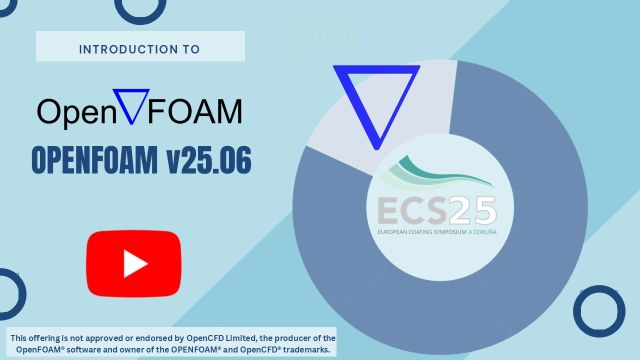

# **Introduction to OpenFOAM® Computational Library and Design of Profile Extrusion Dies**
## João Miguel Nóbrega and Mohammadreza Aali
## University of Minho

# System Setup


## 1-Introduction


[Video](https://youtu.be/XPClAtVewAU)


## 2-Windows Subsystem Linux


[Video](https://youtu.be/gRKmsotZp4Y)

```
wsl –-install -d Ubuntu-24.04
```

## 3-Visual Studio Code


[Video](https://youtu.be/hzr0HRTfKgA)

Installation website: https://code.visualstudio.com/

## 4-OpenFOAM v2512


[Video](https://youtu.be/3x1gUifncLA)

Installation website: https://gitlab.com/openfoam/core/openfoam/-/wikis/precompiled/debian

## 5-Paraview 6.1.1


[Video](https://youtu.be/JEJfGAcsZgQ)

Installation website: https://www.paraview.org/download/


## 6-FreeCAD 1.1.1


[Video](https://youtu.be/3x1gUifncLA)

Installation website: https://www.freecad.org/downloads.php